# 3Dモデル変換チュートリアル

[English](README.md) | 日本語

# **Blender VRM 初心者向けエクスポートガイド：キャラクターに命を吹き込もう！**

ようこそ！このガイドは特に**3D初心者**のために作られました。
Blenderの**VRMアドオン**を使用してモデルを`.vrm`ファイルとしてエクスポートする手順を説明します。心配しないでください、すべてをシンプルで分かりやすく説明します。さあ、始めましょう。

---

## **ステップ1：基本準備（プラグインのインストールとモデルの確認）**

### **VRMアドオンのインストール**

これが最初のステップです。Blenderが VRM ファイルを認識できるように「翻訳機」（プラグイン）をインストールする必要があります。

**Blenderがバージョン4.2以上の場合：**

1. Blenderを開き、上部メニューの**編集 > プリファレンス**に移動
2. ポップアップウィンドウで**拡張機能**タブに移動
3. **VRM format**を検索して直接インストール

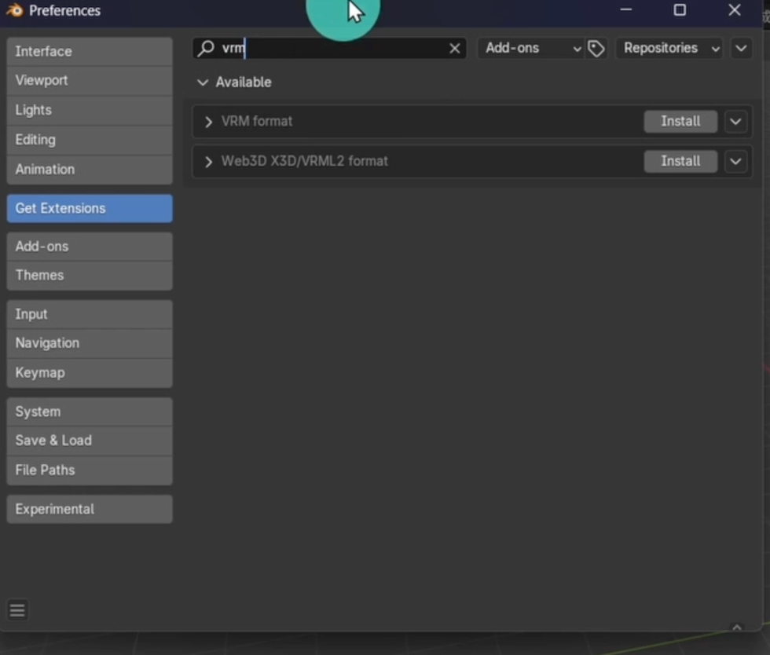

**Blenderがバージョン2.93から4.1の場合：**

1. プラグインを`.zip`ファイルとしてダウンロード（**解凍しないでください**）：

   - [https://vrm-addon-for-blender.info/releases/VRM_Addon_for_Blender-release.zip](https://vrm-addon-for-blender.info/releases/VRM_Addon_for_Blender-release.zip)
2. Blenderを開き、**編集 > プリファレンス**に移動
3. ポップアップウィンドウで**アドオン**タブに移動
4. **インストール...**をクリックし、ダウンロードした`.zip`ファイルを選択
5. アドオンリストで「VRM」を検索し、**VRM format**を見つけて**チェックボックス**をオンにして有効化

### **3Dモデルの準備**

すでに3Dモデル（.fbx、.obj、.glb）がある場合は、Blenderにインポートします：

1. 上部メニューの**ファイル > インポート**に移動
2. モデルに合ったファイル形式を選択（例：**Filmbox (.fbx)**または**Wavefront (.obj)**）
3. モデルを見つけて**インポート**をクリック

これでBlenderの3Dビューポートにモデルが表示されるはずです。

VRMセットアップを開始する前に、モデルが準備できているか「健康チェック」をしましょう。

**モデルは「クリーン」ですか？**
モデルが穴や浮遊面、重複ジオメトリのない完全なメッシュであることを確認してください。

### **すべてのトランスフォームを適用（非常に重要！）**

1. **オブジェクトモード**でモデルを選択
2. **Ctrl + A**（キーボード）を押す
3. メニューから**すべてのトランスフォーム**を選択

**なぜ？** これはBlenderに「これが正しい形のモデルです」と伝えます。
このステップをスキップすると、エクスポート後にモデルが潰れたり、伸びたり、位置がずれたりする可能性があります。

### **VRMプラグインインターフェースの理解**

プラグインをインストールすると、3Dビューポートのサイドバーに表示されます。

1. 3Dビューポートで**N**（キーボード）を押してサイドバーを開く
2. **VRM**タブをクリック
3. **VRM Meta**（モデル情報）、**Humanoid**（スケルトン）、**Blend Shape**（表情）、**Spring Bone**（物理演算）が表示されます。順番に使用していきます。

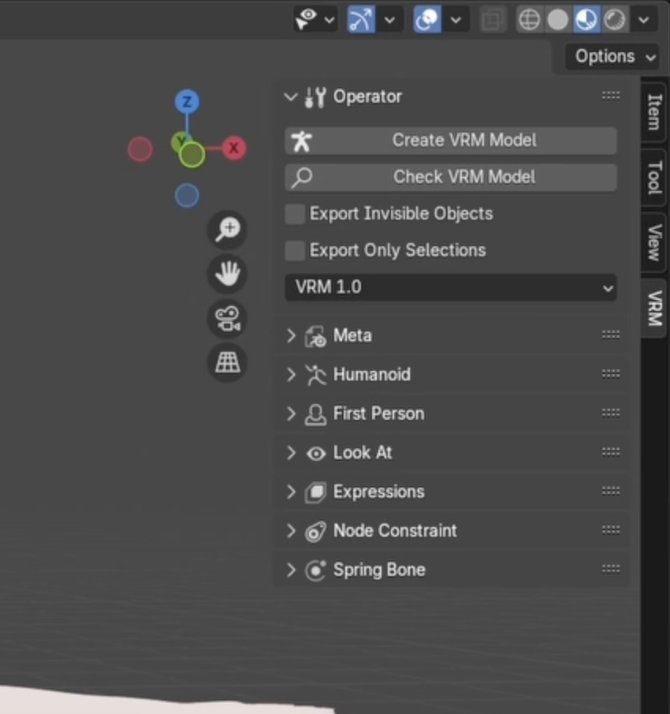

---

## **ステップ2：スケルトンのバインド（モデルに「人間」であることを教える）**

VRMは体の部位を認識するために標準的なヒューマノイドスケルトンが必要です。

### **方法1：新しいVRMスケルトンを作成**

これは初心者にとって最も簡単な方法です。

1. 3Dビューポートで**Shift + A**（キーボード）を押す
2. **アーマチュア > VRM Humanoid**を選択
3. 標準的なヒューマノイドスケルトンが表示されます
4. スケルトンを選択し、**編集モード**に切り替え（**Tab**キーを押す）

**ボーンを整列：**
ジョイントをモデルの主要なポイントに合わせて移動します。

- 例えば、**knee.L**ジョイントをモデルの左膝の中心に移動

**ヒント：** スケルトンプロパティ（緑色の人アイコン）で**X軸ミラー**を有効にすると、両側を同時に調整できます。

**モデルをバインド：**
**オブジェクトモード**に戻る：

1. **最初にメッシュを選択**し、次に**Shiftを押しながらスケルトンを選択**
2. **Ctrl + P**（キーボード）を押し、**自動のウェイトで**を選択

これでモデルがスケルトンにバインドされました。

### **方法2：既存のスケルトンをマッピング**

モデルにすでにスケルトンがある場合は、どのボーンがVRMボーンに対応するかをVRMプラグインに伝える必要があります。

1. **ポーズモード**に切り替え、**A**（キーボード）を押して既存のスケルトンを選択
2. **N**（キーボード）を押してサイドバーを開き、**VRM**タブをクリックし、**Humanoid**パネルを展開
3. **Hips**（骨盤）、**Spine**（脊柱）などのボーンを示すリストが表示されます
4. まず、**自動ボーン割り当て**をクリックして、プラグインが対応するボーンを自動的にマッチングできるか確認できます
   
5. 手動で割り当てたい場合は、各スロットをクリックし、ドロップダウンメニューからスケルトンの対応するボーンを選択します（例：`My_Waist_Bone`を**Hips**に割り当て）
6. **VRMモデルをチェック**をクリックして、すべての必須ボーンが正しく割り当てられていることを確認

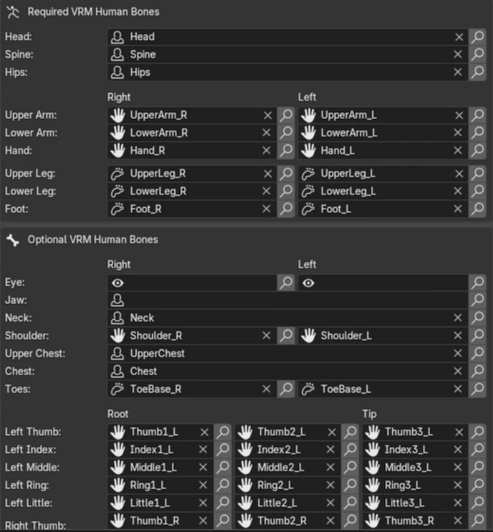

### **必須：Tポーズ**

VRMは標準的な「Tポーズ」（腕をまっすぐ伸ばし、手のひらを下に向ける）が必要です。

1. スケルトンを選択し、ポーズモードに入り、正面の正投影ビューに切り替え

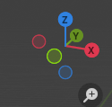
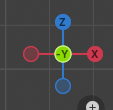

1. 肩と鎖骨を回転させて完璧なTポーズを実現

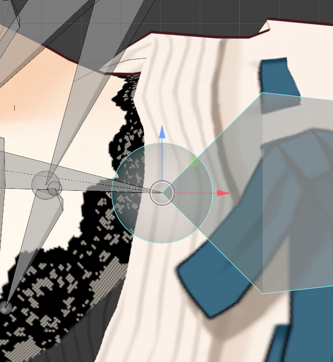
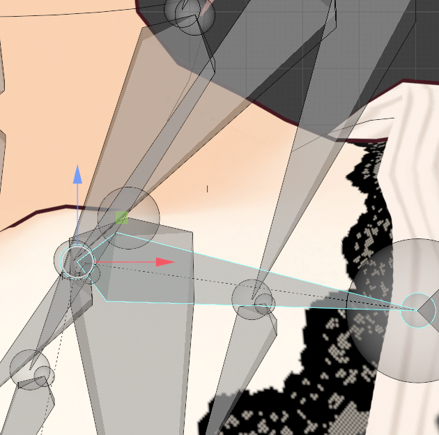

**上級者向けヒント：** Blenderの対称機能を使用して両側を一度に調整します。

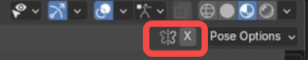

対称が失敗した場合は、座標を手動で調整します。

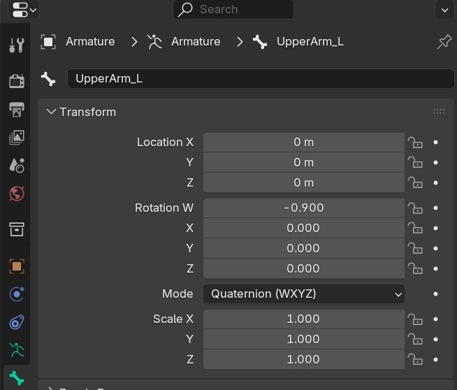

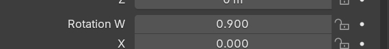

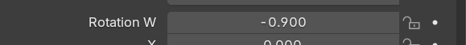

> （画面上の指示）
> ⚠️ **超重要：** 表情を作成する**前に**Tポーズを完成させてください。
> そうしないと、エクスポート後に表情がモデルの腕や体を壊す可能性があります。
> **正しい順序：** 1. Tポーズを設定 → 2. 表情を作成
> **間違った順序：** 1. 表情を作成 → 2. Tポーズを設定（モデルが破損する可能性があります！）

---

## **ステップ3：マテリアルの設定（モデルを「アニメ風」にする）**

VRMはアニメスタイルの外観のために**MToon**マテリアルを推奨しています。

1. メッシュを選択
2. プロパティパネルで**マテリアルプロパティ**（赤い円のアイコン）に移動
3. 新しいマテリアルを作成するか、既存のものを選択
4. **VRM Material**までスクロールし、**Use VRM MToon Shader**を有効化

主要なオプション：

- **Lit Color**：明るい部分の色（通常はテクスチャ）
- **Shade Color**：影の色（通常は同じテクスチャで暗め）
- **Shading Toony**：0 = 滑らかなグラデーション、1 = アニメスタイル；**1を推奨**
- **Shading Shift**：影の強さを調整；負の値（例：-0.1）で顔を明るくする

### **アウトラインの追加（オプション）**

**Outline**で、モードを**World Coordinates**に設定し、**Outline Width**と**Outline Color**を調整します。

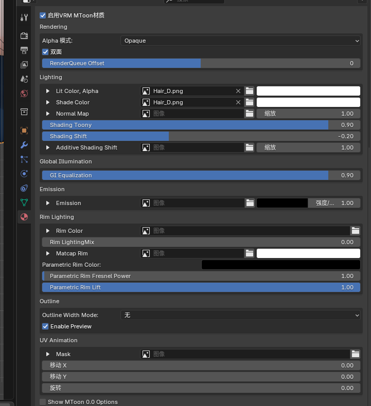

---

## **ステップ4：表情の作成（顔の造形！）**

### **モデルにシェイプキーがない場合：**

VRMの表情はBlenderの**シェイプキー**を使用します。（そのため作成する必要があります）

#### **シェイプキーの作成**

1. 顔のメッシュを選択
2. プロパティパネルで**オブジェクトデータプロパティ**（緑色の三角形）に移動
3. **シェイプキー**パネルを開く。**Basis**はそのままにしておく
4. **+**を2回クリックして新しいキーを作成
5. Key 1を**Blink**（まばたき用）にリネーム

#### **表情の彫刻**

1. **Blink**を選択し、**Value**を1.0に設定
2. **Tab**（キーボード）を押して**編集モード**に入る
3. 頂点を移動して閉じた目を作成
4. **Tab**（再度）を押してオブジェクトモードに戻る

**Value**をスライドしてまばたき効果を確認します。

### **標準表情の作成**

VRM標準の表情とビゼームを作成する必要があります：（特定の命名規則に従う）

**感情：**

- Joy、Angry、Sorrow、Fun、Surprised、Neutral

**目：**

- Blink、Blink_L、Blink_R

**口（ビゼーム）：**

- A、E、I、O、U

### **表情のバインド**

1. **VRM**タブ → **Expression**パネルを開く
2. **+**をクリックして新しい表情を追加（例：Blink）
3. **Morph Target Binds**で、メッシュと対応するシェイプキーを選択
4. **Weight** = 1.0に設定

すべての表情について繰り返します。

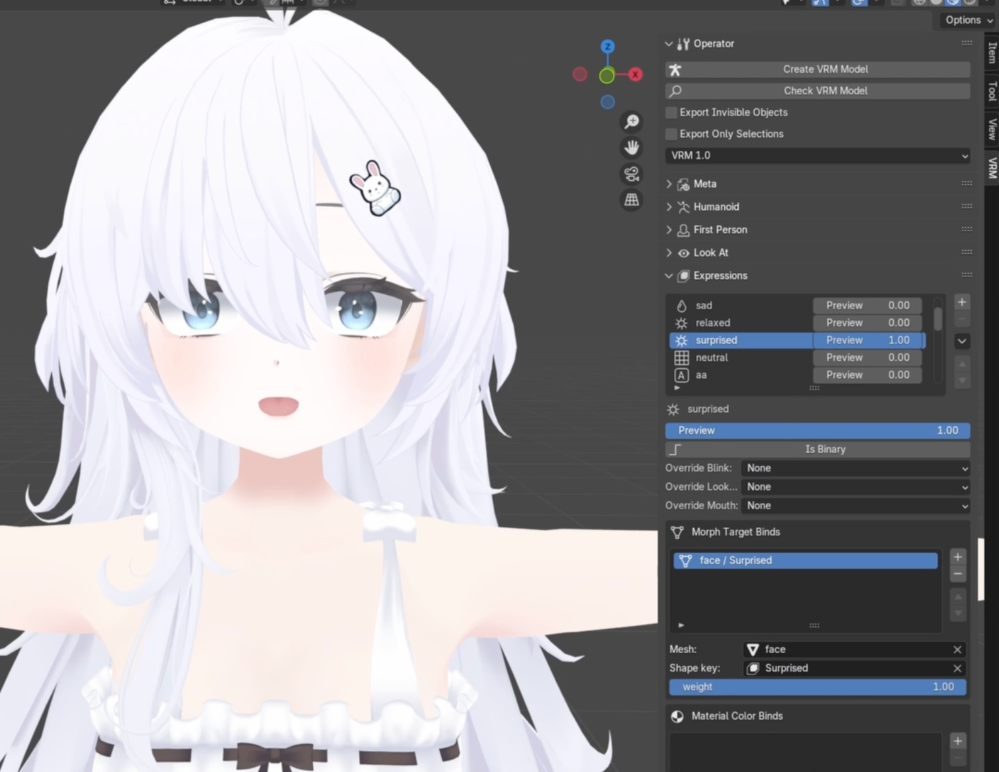

---

## **ステップ5：物理演算の追加**

**スプリングボーン**は、モデルの髪、スカート、尻尾を自然に動かすために使用されます。
**コライダーグループ**は、スプリングボーンが体を貫通しないようにするオブジェクトです。

3つの部分で構成されています：

- **ジョイント**：動く部分（例：ポニーテールのボーン）
- **コライダー**：髪が体を貫通しないようにする見えないバリア（通常は頭や胸に配置）
- **スプリング**：ジョイントとコライダーを接続して「弾力性」を調整するコントローラー

### コライダーの作成

1. **N**サイドバーで、**VRM**タブに移動し、**Spring Bone**パネルを展開

   1. Nサイドバー（Nメニューとも呼ばれる）が表示されない場合は、マウスを3Dビューポートに移動し、キーボードで「N」を押すと、右側にサイドバーが表示されます
2. **Spring Bone Colliders**を展開し、**+**をクリックして新しいコライダーを追加（例：**Sphere**）
   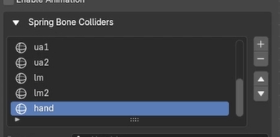
3. スケルトンを選択し、**ポーズモード**に切り替え、スナップツールを使用してコライダーを対応するボーンにバインド
   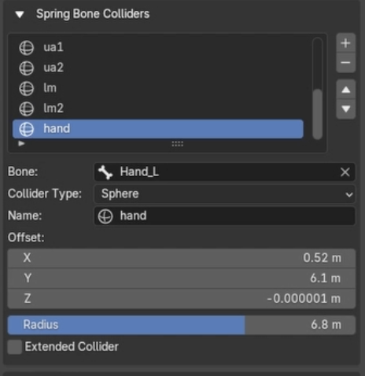
4. **オブジェクトモード**に戻り、コライダーを正しい位置（例：頭の中心）に移動
   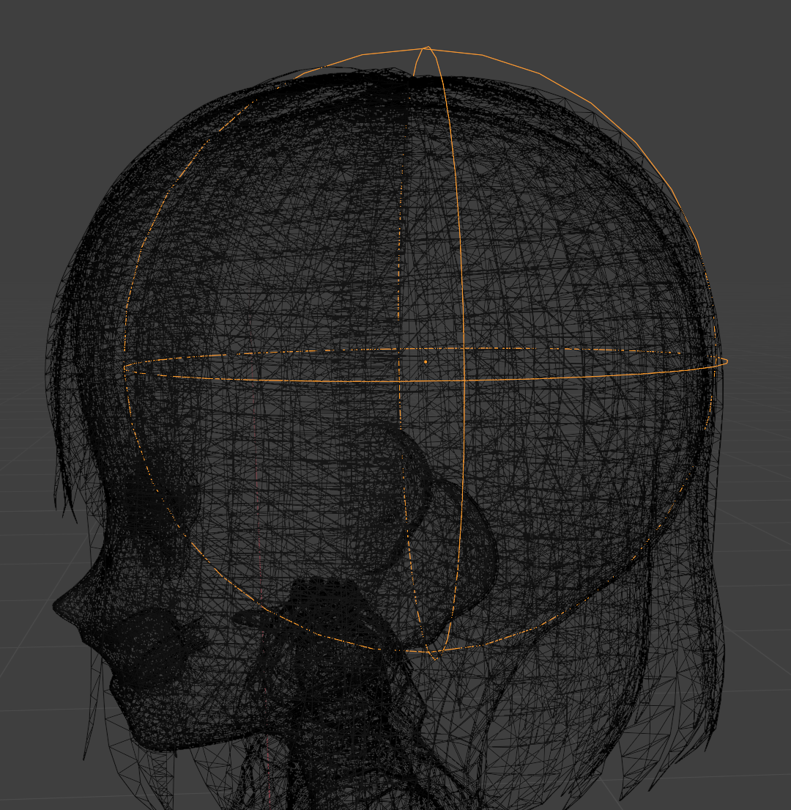
5. これらの手順を繰り返して、キャラクターのすべての部分にコライダーがあることを確認
   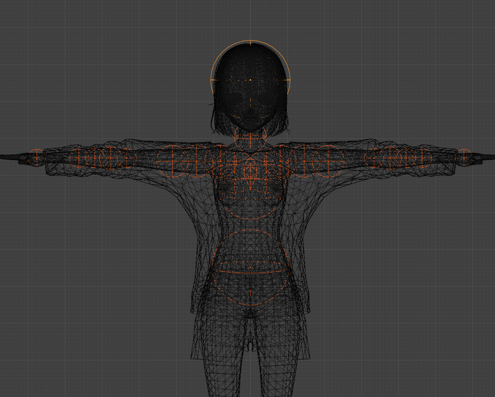

### コライダーグループの作成

1. **Spring Bone Collider Groups**を展開
2. **+**（右側）をクリックして新しいグループを作成（例：`Head_Colliders`）
   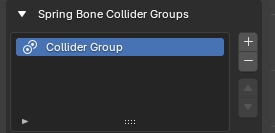
3. 作成したコライダーをこのグループに割り当て
   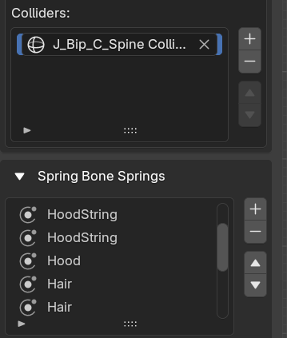

### スプリングの設定

1. **Spring Bone Springs**で、**+**（上部）をクリックして新しいスプリングを作成（例：`Hair_Ponytail`）
2. パラメータを調整：
   - **Stiffness**：値が高いほど髪が「硬く」なり、動きが減少
   - **Gravity**：重力によって髪がどれだけ垂れ下がるかを決定
   - **Drag Force**：値が高いほど動きが早く止まる（水中を移動するような感じ）
     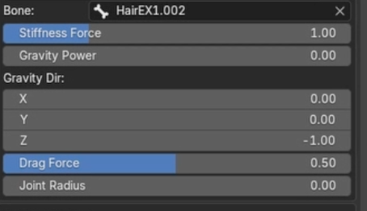

### ジョイントの割り当て

- **Joints**リストで、ポニーテールのボーンチェーンを根元から先端まで追加
  **ヒント：** ボーンチェーンが適切に命名されている場合、プラグインは最初のボーンを追加した後、次のボーンを自動的にマッチングします

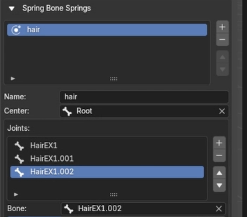

### コライダーグループのリンク

- **Collider Groups**リストで、作成した`Head_Colliders`グループを追加

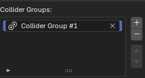

---

## ステップ6：最終確認とエクスポート（「身分証明書」の記入）

これが最後のステップです！モデルの「身分証明書」と著作権情報を記入する必要があります。

### モデル情報の記入（Meta）

1. **N**サイドバーで、**VRM**タブに移動し、**VRM Meta**を展開
2. 記入：
   - **Thumbnail**：必須、プレビュー画像を選択
   - **Title**：モデルの名前
   - **Author**：あなたの名前
   - オプション：連絡先情報、バージョン番号など

### 使用許可の設定（重要！）

**VRM Meta**パネルで、他の人があなたのモデルで何をすることが許可されているかを慎重に定義します：

- **Avatar Usage**：誰が使用できるか？（作者のみ / 誰でも）
- **Commercial Usage**：商用目的で使用できるか？（はい / いいえ）
- **Modification**：他の人がモデルを修正できるか？（はい / いいえ）
- ...など。好みに応じて設定してください。

### エクスポート！

- 再確認：Tポーズは適用されていますか？すべてのトランスフォームは適用されていますか？メタ情報は完全ですか？
- すべてが正しければ、**ファイル > エクスポート > VRM (.vrm)**に移動

---

## 完了！

おめでとうございます！すべてがうまくいけば、`.vrm`ファイルができました。
お気に入りのソフトウェアにインポートして、キャラクターが生き生きと動くのを見てください！

