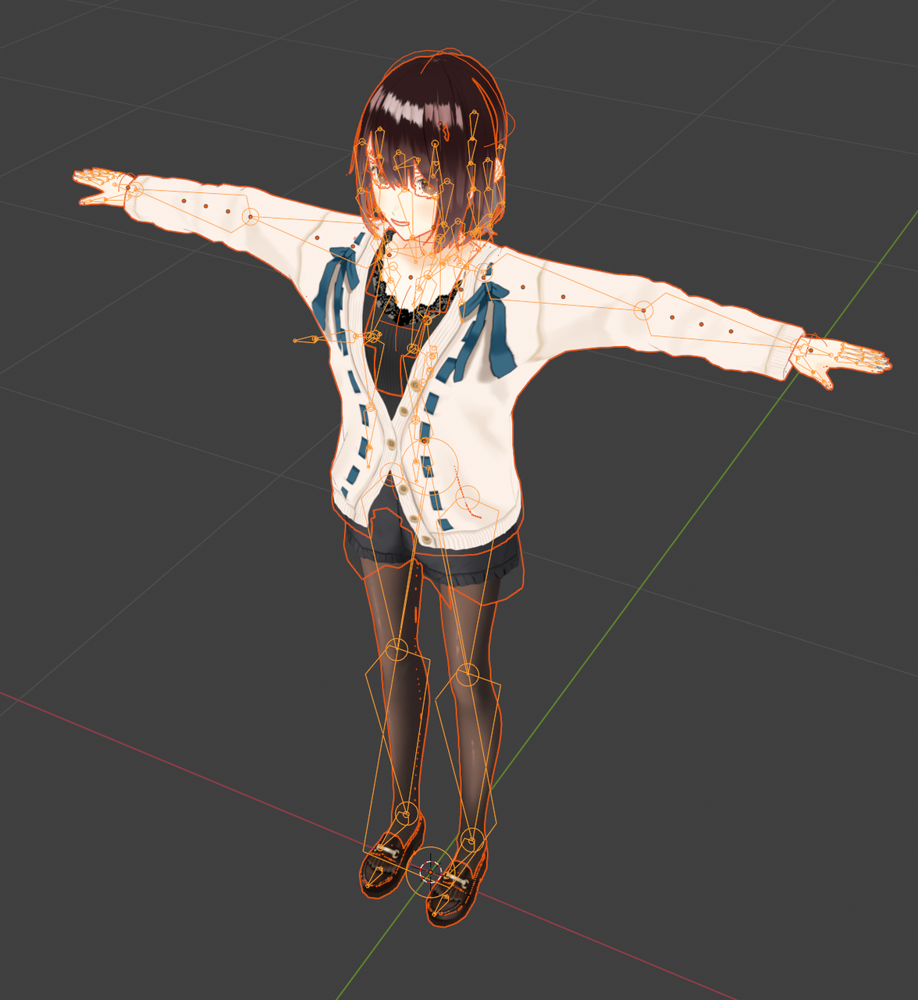

# Tutorial for 3D Model Conversion

English | [日本語](README.ja.md)

# **Blender VRM Beginner Export Guide: Bring Your Character to Life!**

Welcome! This guide is designed especially for **3D beginners**.
We’ll take you through the process of using Blender's **VRM Add-on** to export your model as a `.vrm` file. Don’t worry, we keep everything simple and easy to follow. Let’s get started.

---

## **Step 1: Basic Preparation (Install Plugin and Check Your Model)**

### **Install the VRM Add-on**

This is the very first step. You need to install a "translator" (plugin) so that Blender can recognize VRM files.

**If your Blender is version 4.2 or above:**

1. Open Blender, go to the top menu **Edit > Preferences**
2. In the pop-up window, go to the **Extensions** tab
3. Search for **VRM format** and install it directly

**If your Blender is version 2.93 to 4.1:**

1. Download the plugin as a `.zip` file (do **not** unzip):

   - [https://vrm-addon-for-blender.info/releases/VRM_Addon_for_Blender-release.zip](https://vrm-addon-for-blender.info/releases/VRM_Addon_for_Blender-release.zip)
2. Open Blender, go to **Edit > Preferences**
3. In the pop-up window, go to the **Add-ons** tab
4. Click **Install...**, select the `.zip` file you just downloaded
5. In the Add-ons list, search for "VRM", find **VRM format**, and **check the box** to enable it

### **Prepare Your 3D Model**

If you already have a 3D model (.fbx, .obj, .glb), import it into Blender:

1. Go to **File > Import** in the top menu
2. Choose the file format that matches your model (e.g., **F****ilmbox**** (.fbx)** or **Wavefront (.obj)**)
3. Locate your model and click **Import**

You should now see your model in the Blender 3D viewport.

Before starting VRM setup, let’s give your model a "health check" to ensure it is ready.

**Is the model "clean"?**
Make sure your model is a complete mesh with no holes, stray faces, or overlapping geometry.

### **Apply All Transforms (Very Important!)**

1. In **Object Mode**, select your model
2. Press **Ctrl + A**** (on your keyboard)**
3. Choose **All Transforms** from the menu

**Why?** This tells Blender: "This is the model in its correct form."
Skipping this step may cause your model to be squashed, stretched, or misaligned after export.

### **Understand the VRM Plugin Interface**

After installing the plugin, it appears in the sidebar of the 3D viewport.

1. Press **N** (on your keyboard) in the 3D viewport to open the sidebar
2. Click the **VRM** tab
3. You will see **VRM Meta** (model info), **Humanoid** (skeleton), **Blend Shape** (expressions), and **Spring Bone** (physics). We will use them step by step.

---

## **Step 2: Bind the Skeleton (Let Your Model Know It’s "Human")**

VRM requires a standard humanoid skeleton to recognize body parts.

### **Method 1: Create a New VRM Skeleton**

This is the easiest method for beginners.

1. Press **Shift + A** (on your keyboard) in the 3D viewport
2. Choose **Armature > VRM Humanoid**
3. You will see a standard humanoid skeleton
4. Select the skeleton, switch to **Edit Mode** (by pressing **Tab**** on your keyboard**)

**Align the bones:**
Move the joints to match key points of your model.

- For Example, let's move **knee.L** joint to the center of the model’s left knee

**Tip:** In the skeleton properties (the green person icon), enable **X-axis Mirror** to adjust both sides simultaneously.

**Bind the model:**
Return to **Object Mode**:

1. **Select your mesh first**, then hold **Shift ****and**** select the skeleton**
2. Press **Ctrl + P**** (on your keyboard)**, choose **With Automatic Weights**

Now your model is bound to the skeleton.

### **Method 2: Map an Existing Skeleton**

If your model already has a skeleton, you need to tell the VRM plugin which bones correspond to VRM bones.

1. Switch to **Pose Mode** and press **A**** (on your keyboard)** to select your existing skeleton.
2. Press **N**** (on your keyboard)** to open the sidebar, click the **VRM** tab, and expand the **Humanoid** panel.
3. You will see a list showing bones such as **Hips** (pelvis), **Spine** (spinal column), etc.
4. First, you can try clicking **Automatic Bone Assignment** to check if the plugin can automatically match the corresponding bones.
   
5. If you want to assign manually, click each slot and select the corresponding bone from your skeleton in the dropdown menu (for example, assign your `My_Waist_Bone` to **Hips**).
6. Click **Check VRM Model** to ensure that all required bones are correctly assigned.

### **Mandatory: T-Pose**

VRM requires a standard "T-Pose" (arms straight out, palms down).

1. Select your skeleton, enter Pose Mode, switch to front orthographic view

1. Rotate shoulders and clavicles to achieve a perfect T-Pose

**Advanced Tip:** Use Blender’s symmetry to adjust both sides at once.

If symmetry fails, tweak coordinates manually.

> (On-screen directions)
> ⚠️ **Super Important:** Complete the T-Pose **before** creating expressions.
> Otherwise, expressions may break your model’s arms or body after export.
> **Correct order:** 1. Set T-Pose → 2. Create expressions
> **Wrong order:** 1. Create expressions → 2. Set T-Pose (may damage model!)

---

## **Step 3: Set Materials (Make Your Model "Cartoonish")**

VRM recommends **MToon** material for anime-style appearance.

1. Select your mesh
2. In the Properties panel, go to **Material Properties** (red circle icon)
3. Create a new material or select an existing one
4. Scroll to **VRM Material**, enable **Use VRM MToon Shader**

Key options:

- **Lit Color**: Color of lit areas (usually a texture)
- **Shade Color**: Color of shadows (usually same texture, darker)
- **Shading Toony**: 0 = smooth gradient, 1 = cartoon-style; **recommend 1**
- **Shading Shift**: Adjust shadow strength; negative values (e.g., -0.1) make the face brighter

### **Add Outline (Optional)**

In **Outline**, set mode to **World Coordinates**, adjust **Outline Width** and **Outline Color**.

---

## **Step 4: Create Expressions (Face Shaping!)**

### **If the model has no shape keys:**

VRM expressions use Blender **Shape Keys**. (so we'll have to)

#### **Create a Shape Key**

1. Select your face mesh
2. In Properties panel, go to **Object Data Properties** (green triangle)
3. Open **Shape Keys** panel. Keep **Basis** untouched
4. Click **+** twice to create a new key
5. Rename Key 1 to **Blink** (for blinking)

#### **Sculpt the Expression**

1. Select **Blink**, set **Value** to 1.0
2. Press **Tab** (on your keyboard) to enter **Edit Mode**
3. Move vertices to create closed eyes
4. Press **Tab** (again) to return to Object Mode

Slide **Value** to see the blink effect.

### **Create Standard Expressions**

(We need to )Create VRM-standard expressions and visemes:(that follow a specific naming convention)

**Emotions:**

- Joy, Angry, Sorrow, Fun, Surprised, Neutral

**Eyes:**

- Blink, Blink_L, Blink_R

**Mouth (Visemes):**

- A, E, I, O, U

### **Bind Expressions**

1. Open **VRM** tab → **Expression** panel
2. Click **+** to add new expression (e.g., Blink)
3. In **Morph Target Binds**, select the mesh and corresponding shape key
4. Set **Weight** = 1.0

Repeat for all expressions.

---

## **Step 5: Add Physics **

**Spring Bones** are used to make your model’s hair, skirt, or tail move naturally.
**Collider Groups** are objects that prevent Spring Bones from passing through the body.

They consist of 3 parts:

- **Joints**: The parts that will move (for example, bones of a ponytail).
- **Colliders**: Invisible barriers to prevent hair from going through the body (usually placed on the head or chest).
- **Springs**: Controllers that connect joints and colliders to adjust “bounciness”.

### Create Colliders

1. In the **N** sidebar, go to the **VRM** tab and expand the  **Spring Bone** panel.

   1. "If you don't see the N sidebar (sometimes referred to as the N menu), move your mouse to the 3D viewport, and press "N" on your keyboard, and a sidebar will appear to the right.
2. Expand **Spring Bone Colliders**, click **+** to add a new collider (for example, a **Sphere**).
   
3. Select the skeleton, switch to **Pose Mode**, and use the snapping tool to bind the collider to the corresponding bone.
   
4. Switch back to **Object Mode** and move the collider to the correct position (e.g., the center of the head).
   
5. Repeat these steps to ensure all parts of your character have colliders.
   

### Create Collider Groups

1. Expand **Spring Bone Collider Groups**.
2. Click **+**** (to the right)** to create a new group (for example, `Head_Colliders`).
   
3. Assign the colliders you just created to this group.
   

### Set Springs

1. In **Spring Bone Springs**, click **+** (at the top) to create a new spring (for example, `Hair_Ponytail`).
2. Adjust parameters:
   - **Stiffness**: Higher values make hair “harder” and reduce movement.
   - **Gravity**: Determines how much hair droops due to gravity.
   - **Drag Force**: Higher values make movement stop faster (like moving through water).
     

### Assign Joints

- In the **Joints** list, add the bone chain of your ponytail from root to tip.
  **Tip:** If your bone chain is properly named, the plugin will automatically match the next bones after adding the first one.

### Link Collider Groups

- In the **Collider Groups** list, add the `Head_Colliders` group you just created.

---

## Step 6: Finalize & Export (Fill in the “ID Card”)

This is the last step! You need to fill in your model’s “ID card” and copyright information.

### Fill in Model Information (Meta)

1. In the **N** sidebar, go to the **VRM** tab and expand **VRM Meta**.
2. Fill in:
   - **Thumbnail**: Required, choose a preview image.
   - **Title**: The name of your model.
   - **Author**: Your name.
   - Optional: contact info, version number, etc.

### Set Usage Permissions (Important!)

In the **VRM Meta** panel, carefully define what others are allowed to do with your model:

- **Avatar Usage**: Who can use it? (Only author / Anyone)
- **Commercial Usage**: Is it allowed for commercial purposes? (Yes / No)
- **Modification**: Can others modify the model? (Yes / No)
- ...and so on. Set according to your preference.

### Export!

- Double-check: Is T-Pose applied? Are all transforms applied? Is the meta information complete?
- If everything is correct, go to **File > Export > VRM (.vrm)**.

---

## Complete!

Congratulations! If everything went well, you now have a `.vrm` file.
Import it into your favorite software and see your character come to life!
